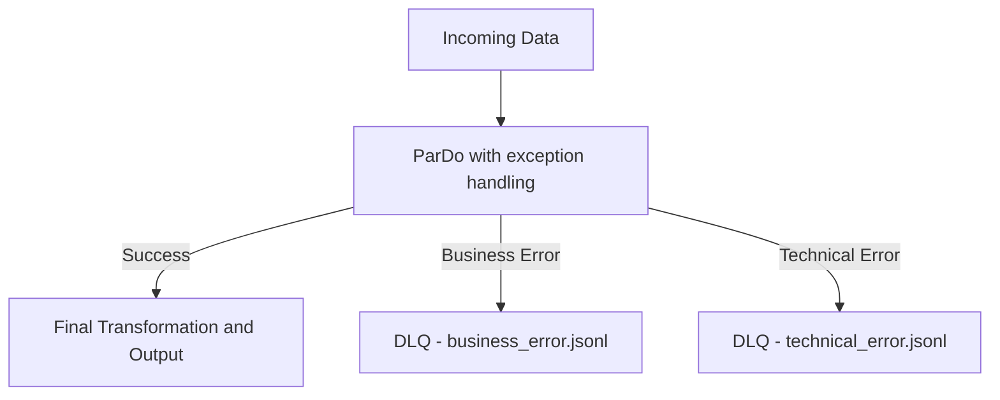

# Building a Resilient Exception Strategy with Apache Beam and DLQ

## Context: when the pipeline stops because of a single record

In a common large-scale data ingestion scenario using Apache Beam, we faced a classic issue: a single malformed record caused the entire pipeline to fail.

It was expected that some records might contain errors, but the pipeline was assuming everything would work perfectly. There was no fallback, no distinction between business or technical errors, and no isolation for problematic data.

This led us to the key question: how do we keep the pipeline healthy even in the presence of predictable failures?

---

## What we needed to solve

- Prevent exceptions from halting the processing of all data
- Separate technical failures (e.g., API errors) from business logic issues (e.g., invalid value)
- Log errors in a structured format for analysis and possible reprocessing
- Implement controlled retry without infinite loops

---

## Proposed Architecture

We implemented an approach based on:

- `ParDo` with `MultiOutputReceiver` and `TupleTag` to separate data flows
- `try/catch` for error classification
- Retry with a max-attempt limit for technical failures
- DLQ (Dead Letter Queue) with `.jsonl` files saved locally

### Flow Diagram:



---

## Local Example with Apache Beam

### Dependencies in `pom.xml`

```xml
<dependencies>
  <dependency>
    <groupId>org.apache.beam</groupId>
    <artifactId>beam-sdks-java-core</artifactId>
    <version>2.55.0</version>
  </dependency>
  <dependency>
    <groupId>org.apache.beam</groupId>
    <artifactId>beam-runners-direct-java</artifactId>
    <version>2.55.0</version>
  </dependency>
  <dependency>
    <groupId>org.slf4j</groupId>
    <artifactId>slf4j-simple</artifactId>
    <version>2.0.7</version>
  </dependency>
</dependencies>
```

---

### `ExceptionHandlingPipeline.java`

```java
package com.example.beam;

import org.apache.beam.sdk.Pipeline;
import org.apache.beam.sdk.io.TextIO;
import org.apache.beam.sdk.metrics.Counter;
import org.apache.beam.sdk.metrics.Metrics;
import org.apache.beam.sdk.transforms.*;
import org.apache.beam.sdk.values.*;
import org.slf4j.Logger;
import org.slf4j.LoggerFactory;

import java.time.Instant;
import java.util.Arrays;
import java.util.List;
import java.util.Random;

public class ExceptionHandlingPipeline {

    private static final Logger LOG = LoggerFactory.getLogger(ExceptionHandlingPipeline.class);

    public static final TupleTag<String> BUSINESS_ERROR_TAG = new TupleTag<String>() {};
    public static final TupleTag<String> TECHNICAL_ERROR_TAG = new TupleTag<String>() {};
    public static final TupleTag<String> SUCCESS_TAG = new TupleTag<String>() {};

    public static void main(String[] args) {
        Pipeline p = Pipeline.create();

        List<String> inputs = Arrays.asList(
            "valid_data_1",
            "valid_data_2",
            "business_error",
            "technical_error",
            "unexpected_exception"
        );

        PCollectionTuple result = p.apply("Create Input", Create.of(inputs))
            .apply("Safe Transform", ParDo
                .of(new SafeProcessFn())
                .withOutputTags(SUCCESS_TAG, TupleTagList.of(BUSINESS_ERROR_TAG).and(TECHNICAL_ERROR_TAG)));

        result.get(SUCCESS_TAG)
              .apply("Write Success", TextIO.write().to("output/success").withSuffix(".txt").withoutSharding());

        result.get(BUSINESS_ERROR_TAG)
              .apply("Format Business Error", MapElements.via(new SimpleFunction<String, String>() {
                  public String apply(String input) {
                      return String.format("{\"timestamp\":\"%s\",\"input\":\"%s\",\"errorType\":\"BusinessError\"}",
                              Instant.now(), input);
                  }
              }))
              .apply(TextIO.write().to("dlq/business_error").withSuffix(".jsonl").withoutSharding());

        result.get(TECHNICAL_ERROR_TAG)
              .apply("Format Technical Error", MapElements.via(new SimpleFunction<String, String>() {
                  public String apply(String input) {
                      return String.format("{\"timestamp\":\"%s\",\"input\":\"%s\",\"errorType\":\"TechnicalError\"}",
                              Instant.now(), input);
                  }
              }))
              .apply(TextIO.write().to("dlq/technical_error").withSuffix(".jsonl").withoutSharding());

        p.run().waitUntilFinish();
    }

    static class SafeProcessFn extends DoFn<String, String> {

        private final Counter businessErrors = Metrics.counter(SafeProcessFn.class, "businessErrors");
        private final Counter technicalErrors = Metrics.counter(SafeProcessFn.class, "technicalErrors");
        private final Counter successCount = Metrics.counter(SafeProcessFn.class, "successCount");

        private static final int MAX_RETRIES = 3;
        private final Random random = new Random();

        @ProcessElement
        public void processElement(@Element String input, MultiOutputReceiver out) {
            int attempt = 0;
            boolean success = false;

            while (attempt < MAX_RETRIES && !success) {
                try {
                    if ("business_error".equals(input)) {
                        businessErrors.inc();
                        throw new IllegalArgumentException("Regra de negócio violada");
                    } else if ("technical_error".equals(input)) {
                        simulateExternalCall(input);
                    } else if ("unexpected_exception".equals(input)) {
                        throw new NullPointerException("Erro inesperado");
                    } else {
                        successCount.inc();
                        out.get(SUCCESS_TAG).output("processed: " + input);
                        success = true;
                    }
                } catch (IllegalArgumentException ex) {
                    out.get(BUSINESS_ERROR_TAG).output(input);
                    return;
                } catch (Exception ex) {
                    attempt++;
                    LOG.warn("Tentativa {} falhou para '{}': {}", attempt, input, ex.getMessage());
                    if (attempt == MAX_RETRIES) {
                        out.get(TECHNICAL_ERROR_TAG).output(input);
                    }
                }
            }
        }

        private void simulateExternalCall(String input) throws Exception {
            if (random.nextInt(3) != 0) {
                throw new RuntimeException("Falha simulada para input: " + input);
            }
        }
    }
}
```

---

## Running Locally

```bash
mvn clean compile exec:java -Dexec.mainClass=com.example.beam.ExceptionHandlingPipeline
```

Output files will be generated in:
- `output/success.txt`
- `dlq/business_error.jsonl`
- `dlq/technical_error.jsonl`

---

## Conclusion

This simple example demonstrates how to handle different types of errors, protect your pipeline, and maintain full visibility over problematic records. It’s essential for anyone building reliable solutions with Apache Beam.

> A resilient architecture is not one that never fails — it's one that handles failure responsibly.

